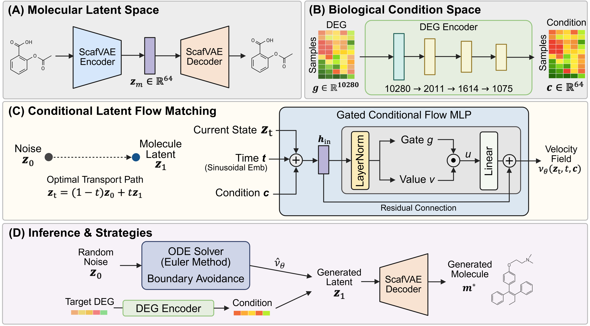

# DEG2MOL



DEG2MOL is a conditional latent flow-matching model for transcriptome-guided
*de novo* molecular generation. A Gene Ontology-informed DEGMON autoencoder
maps a 10,280-gene differential-expression profile to a 64-dimensional
condition. A Gated MLP then transports Gaussian noise into the 64-dimensional
ScafVAE molecular latent space, and the frozen ScafVAE decoder returns SMILES.

This repository contains the accepted scaffold-split and random-split
implementation. The large data and pretrained checkpoints are distributed as
separate archives; every runtime path in the code is relative to this repository.

## 1. Clone and create an isolated environment

Clone ScafVAE at the exact pinned revision by including submodules:

```bash
git clone --recurse-submodules https://github.com/KU-MedAI/DEG2MOL.git
cd DEG2MOL
bash scripts/setup_environment.sh
conda activate deg2mol
```

The setup creates a new `deg2mol` Conda environment and does not modify an
existing Python environment. The known-good stack is Python 3.8.20, PyTorch
1.10.2+cu113, pandas 1.2.2, SciPy 1.10.1, RDKit 2022.09.5,
torch-geometric 2.0.4, and ScafVAE commit `2157430`.

If the repository was cloned without submodules, run:

```bash
git submodule update --init --recursive
```

## 2. Download external assets

[Download the DEG2MOL data and checkpoints from Google Drive][deg2mol-assets]

The shared folder contains the data and checkpoint archives. Extract both
archives into the repository root. After extraction, the relevant layout must
be:

```text
DEG2MOL/
├── checkpoints/
│   ├── scaffold/best_model.pt
│   ├── random/best_model.pt
│   ├── DEGMON_AE_BestModel_Lv7to5_lam1e-05.pth
│   └── ScafVAE.chk
├── data/
│   ├── BP/gene_attribute_matrix_overlap_with_L1000_260320.csv
│   ├── splits/
│   │   ├── scaffold/{train,valid,test}.feather
│   │   └── random/{train,valid,test}.feather
│   ├── scafvae/deg2mol_64dim/
│   │   ├── feat/*.npz
│   │   ├── scaf/*.npz
│   │   ├── train_list.txt
│   │   └── val_list.txt
│   └── inference/
│       └── KO/extra_test.feather
└── third_party/ScafVAE/
```

Training needs both ScafVAE `feat` and `scaf` files. Testing uses `scaf` only to
reproduce the accepted evaluation cohort (rows without the corresponding asset
are excluded, as in the accepted script). Inference needs neither directory.

Validate an extracted archive before running a model:

```bash
python scripts/validate_assets.py --role test --split scaffold
python scripts/validate_assets.py --role test --split random
python scripts/validate_assets.py --role train --split scaffold
```

Validation checks expected sizes and SHA-256 hashes from
`assets_manifest.json`. Add `--skip-hash` for a faster path/size-only check.

## 3. Reproduce test-set generation and evaluation

Scaffold split:

```bash
python test.py --split scaffold --num-samples 100 --guidance-scale 3
```

Random split:

```bash
python test.py --split random --num-samples 100 --guidance-scale 3
```

The default scaffold-availability filter matches the accepted evaluation code.
Use `--skip-scaffold-filter` only when intentionally evaluating every DEG row.

For a quick smoke run, append
`--max-eval-samples 2 --num-samples 2 --num-steps 2`. Outputs are written to
`outputs/test/<split>/`:

- `generated_molecules.csv`: portable generated SMILES table
- `generated_molecules_dict.pkl`: legacy RDKit-molecule result dictionary
- `compound_embeddings.npz`: per-input mean generated latent
- `evaluation_results.json`: validity, uniqueness, and novelty

## 4. Inference on a DEG table

```bash
python inference.py \
  --split scaffold \
  --input-path data/inference/KO/extra_test.feather \
  --num-samples 100 \
  --guidance-scale 3
```

Use `--split random` to select `checkpoints/random/best_model.pt`. An explicit
checkpoint can be supplied with `--model-checkpoint path/to/best_model.pt`.

The input may be Feather or CSV and must contain:

- `cmap_name`: a stable row identifier
- one numeric column for each of the 10,280 genes in the supplied gene-order
  matrix

Extra metadata columns are ignored. Gene columns may appear in any order; the
loader reorders them exactly. Missing required genes cause a clear error and are
never silently filled with zero. The input file is read-only. Results default to
`outputs/inference/<split>/<input-file-stem>/`.

The minimal notebook at `tutorial/inference.ipynb` calls this same entry point
with the accepted random-split checkpoint by default, instead of maintaining a
second inference implementation.

## 5. Training

The accepted hyperparameters are defaults. To retrain the scaffold split:

```bash
python train.py --split scaffold
```

To retrain the random split:

```bash
python train.py --split random
```

Training reads `train.feather`, `valid.feather`, and the ScafVAE task assets.
It writes a timestamped run under `outputs/training/<split>/` and never writes
to the source data directories. The saved `best_model.pt` uses EMA weights,
matching the accepted checkpoints. Exact accepted settings and checkpoint
metrics are recorded in `configs/` and `SOURCE_PROVENANCE.md`.

All path options accept an absolute override, but the defaults are repository
relative. Run `python train.py --help`, `python test.py --help`, or
`python inference.py --help` for the complete options.

## Checkpoint identity

| Asset | Size | SHA-256 |
|---|---:|---|
| Scaffold flow | 124,226,367 B | `6714ad14bfa57156a3786217358de5292d319be1a41d9ed233b576ba4847b546` |
| Random flow | 124,226,367 B | `fdcb6ee89ceae42e7373bf8262d02fd1ad918f7db5dda92d36dcb3617ff6d421` |
| DEGMON AE | 206,026,320 B | `3631ca9eb74394f50f490c7d844f11e80393044a92a0c6fab6809964c9100ff8` |
| ScafVAE | 1,303,799,751 B | `fcfe2038dd056c2cdabb9a7420a211fbaf209a2be379b8112d2c272142499d04` |

These binaries and datasets are intentionally excluded from Git. GitHub
[blocks regular Git objects larger than 100 MiB](https://docs.github.com/en/repositories/working-with-files/managing-large-files/about-large-files-on-github),
so the separate archives avoid partial or unusable clones. See
`assets_manifest.json` for all data identities.

## Third-party component

ScafVAE is included as a pinned submodule from
[tiejundong/ScafVAE](https://github.com/tiejundong/ScafVAE). Its source and
license remain in that submodule. Please cite the corresponding DEG2MOL and
ScafVAE publications when using this code.

<!-- Maintainer: replace only the URL below with the shared Google Drive folder URL. -->
[deg2mol-assets]: PASTE_GOOGLE_DRIVE_URL_HERE
